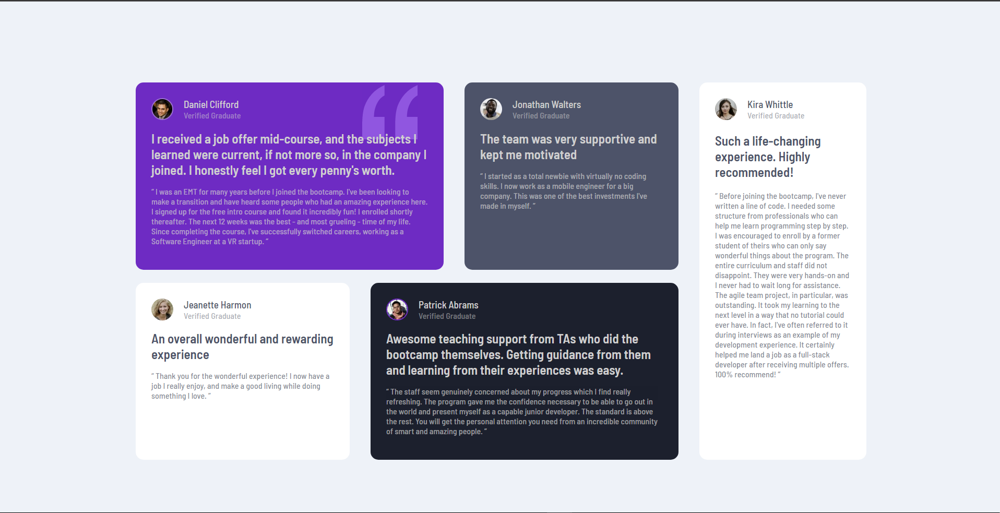

# Frontend Mentor - Testimonials grid section solution

This is my solution to the [Testimonials grid section challenge on Frontend Mentor](https://www.frontendmentor.io/challenges/testimonials-grid-section-Nnw6J7Un7). Frontend Mentor challenges help improve coding skills by building realistic projects. 

## Table of contents

- [Overview](#overview)
  - [The challenge](#the-challenge)
  - [Screenshot](#screenshot)
  - [Links](#links)
- [My process](#my-process)
  - [Built with](#built-with)
  - [What I learned](#what-i-learned)
  - [Continued development](#continued-development)
  - [Useful resources](#useful-resources)
- [Author](#author)

## Overview

### The challenge

Users should be able to:

- View the optimal layout for the site depending on their device's screen size

### Screenshot




### Links

- Solution URL: [Add solution URL here](https://your-solution-url.com)
- Live Site URL: [URL to live site(Netlify)](https://thunderous-melba-17ce53.netlify.app/)

## My process

### Built with

- Semantic HTML5 markup
- CSS Grid
- Sass/Scss: [Sass Documentation](https://sass-lang.com/)
  1. Sass Functions
  2. Sass Mixins
  3. Sass and BEM
  4. Sass Variables
  5. Sass Built-In Modules

### What I learned

The BEM Model
```scss
.grid{
  display: grid;
  &__item-1 {
    background-color: red;
  }
}
```
Mixins and Media Queries
```scss
@mixin breakpoint-down () {
    @media (max-width: 820px) {
        @content;
    }
}
```

### Continued development

Using more challenges from online forums like Frontend Mentor, I will continue to learn more on Responsive Web Design using HTML and CSS.

### Useful resources

- [Coder Coder - Sass and BEM](https://youtu.be/jfMHA8SqUL4) - This helped me learn Responsive design using Sass and the BEM Model.
- [Coder Coder - Git and Github](https://youtu.be/8Dd7KRpKeaE) - This helped me learn Git and Github when manipulating my files in my repository.
- [Web Dev Simplified - CSS Grid](https://youtu.be/9zBsdzdE4sM) - This helped me understand CSS Grid for the Desktop Design.

## Author

<!-- - Website - [Add your name here](https://www.your-site.com) -->
- Frontend Mentor - [@raphaelkathambana](https://www.frontendmentor.io/profile/raphaelkathambana)